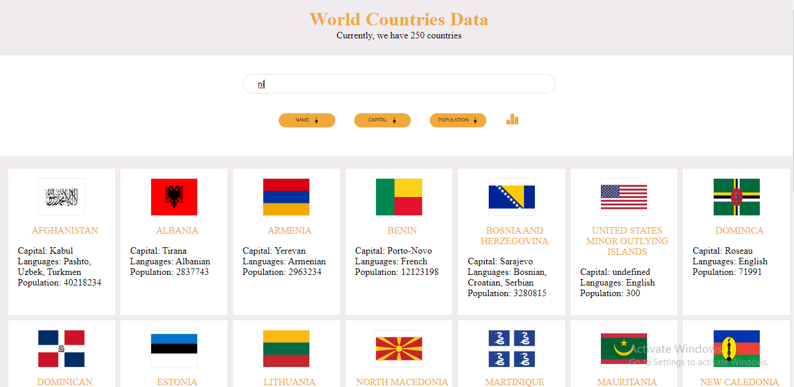

# asabeneh-world-countries-project
*This is an application built with `HTML`, `CSS` and `JavaScAript`. It contains all the countries in the world, each with its population, name, capital and their spoken languages. You can search with any features which each country has. And below it there's a Bar chart which displays ten most populated countries in the world and ten most spoken languages. 
    Also the countries can be sorted in order name, capital and language*
## Prequisite
- Your browser version should be up to date for better experience
## Features
- Home page
## Tech/framework used
- Html
- Css
- JavaScript
## Preview here
[Go Live](https://stately-kataifi-5e13a1.netlify.app)

## Contact
If you want to contact me you can reach me at
- https://github.com/Intelligence247 or
- uthmanabdullahi2020@gmail.com
## Addtional Info
- This is one of the series of project for the @Asabeneh 30-Days-Of-JavaScript
- This is not meant for production. It's for learning purpose only
